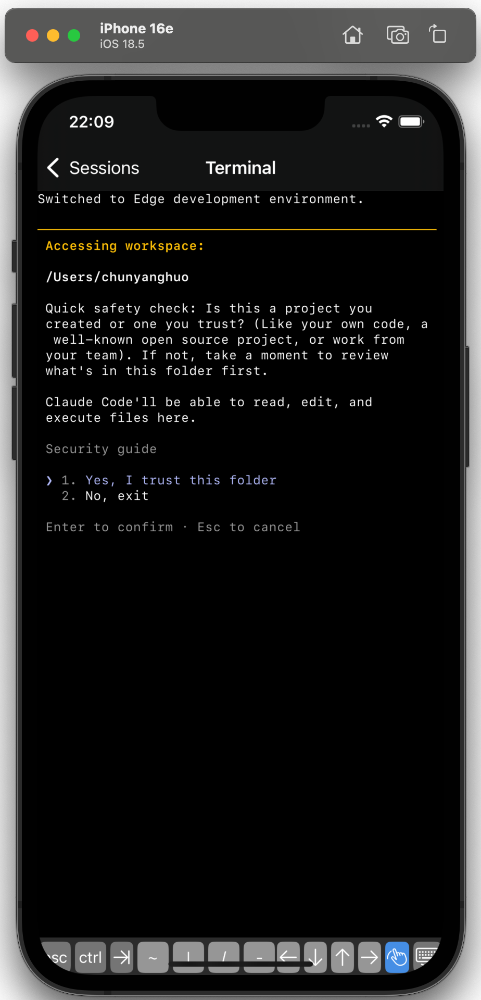

# Reb — Remote Agent Terminal

Control Claude Code CLI on your Mac from anywhere — via an iOS app or a web browser.

<p align="center">
  
</p>

```
┌──────────────┐                        ┌──────────────────┐
│  iOS App /   │   WebSocket (binary)   │  Mac Mini Server  │
│  Web UI      │ ◄────────────────────► │  (Node.js + PTY)  │
│              │   over Tailscale/LAN   │  └─ claude CLI    │
└──────────────┘                        └──────────────────┘
```

## Project Structure

```
reb/
├── server/          # Node.js WebSocket server (TypeScript)
│   ├── src/
│   │   ├── index.ts       # Entry point, loads .env config
│   │   ├── server.ts      # WebSocket server + static file serving
│   │   ├── session.ts     # PTY session manager (node-pty)
│   │   ├── auth.ts        # bcrypt token auth + rate limiting
│   │   ├── protocol.ts    # Binary/JSON message protocol
│   │   └── generate-token.ts
│   ├── public/            # Legacy static web UI (single HTML file)
│   └── .env               # Server config (not committed)
│
├── webui/           # React web UI (Vite + Tailwind + Zustand)
│   └── src/
│       ├── pages/         # ConnectPage, TerminalPage
│       ├── components/    # SessionTabs, TerminalView (xterm.js)
│       ├── stores/        # connectionStore, sessionStore (Zustand)
│       ├── hooks/         # useWebSocket
│       └── lib/           # protocol helpers
│
└── ios/             # SwiftUI iOS app
    └── Reb/
        ├── RebApp.swift
        ├── Services/      # WebSocketService
        ├── Models/        # Connection profiles, Keychain storage
        └── Views/         # ConnectionView, SessionListView, TerminalView (SwiftTerm)
```

## Quick Start

### 1. Server

```bash
cd server
npm install
npm run build

# Generate auth token (prompted for a passphrase, 8+ chars)
npm run generate-token
# Copy the output hash

cp .env.example .env
# Paste hash into AUTH_TOKEN_HASH=
```

**.env config:**

| Variable | Default | Description |
|----------|---------|-------------|
| `PORT` | `7680` | WebSocket + HTTP port |
| `AUTH_TOKEN_HASH` | *(required)* | bcrypt hash from `generate-token` |
| `CLAUDE_PATH` | auto-detect | Full path to `claude` binary |
| `TLS_CERT_PATH` | — | TLS cert for `wss://` (optional) |
| `TLS_KEY_PATH` | — | TLS key for `wss://` (optional) |

```bash
npm start              # Production
npm run dev            # Development (auto-rebuild)
```

### 2. Web UI

```bash
cd webui
npm install
npm run dev            # → http://localhost:5173 (proxies WS to server)
npm run build          # Production build → webui/dist/
```

### 3. iOS App

1. Open `ios/Reb.xcodeproj` in Xcode
2. SwiftTerm resolves automatically via SPM
3. Select iPhone simulator → **Cmd+R**
4. Targets iOS 16+

## Testing

### Server — wscat

```bash
npx wscat -c ws://localhost:7680

> {"type":"auth","token":"YOUR_PASSPHRASE"}
< {"type":"auth_result","success":true}

> {"type":"create_session","cols":80,"rows":24}
< {"type":"session_created","sessionId":"..."}
< (binary terminal output)

> {"type":"list_sessions"}
> {"type":"kill_session","sessionId":"..."}
```

### Web UI

1. Open http://localhost:5173
2. Host: `localhost` · Port: `7680` · Token: your passphrase
3. Connect → **+ New Session** → Claude CLI terminal

### iOS Simulator

1. Build & run in Xcode
2. Host: `localhost` · Port: `7680` · Token: your passphrase
3. Connect → New Session → SwiftTerm renders Claude

### iOS Device (Remote via Tailscale)

1. Install [Tailscale](https://tailscale.com) on Mac + iPhone (same account)
2. Get Mac's Tailscale IP: `tailscale ip -4` → e.g. `100.64.x.y`
3. In iOS app, use `100.64.x.y` as host
4. Traffic is encrypted via WireGuard — no port forwarding needed

## Auto-Start on Boot

```bash
cp server/com.reb.server.plist ~/Library/LaunchAgents/
launchctl load ~/Library/LaunchAgents/com.reb.server.plist
```

## Protocol

Text frames = JSON control messages. Binary frames = terminal I/O.

```
Client → Server:  [0x01][16-byte session UUID][terminal data]
Server → Client:  [0x02][16-byte session UUID][terminal data]
```

| Direction | Type | Payload |
|-----------|------|---------|
| C→S | `auth` | `{ token }` |
| S→C | `auth_result` | `{ success, error? }` |
| C→S | `create_session` | `{ cols, rows, command? }` |
| S→C | `session_created` | `{ sessionId }` |
| C→S | `resize` | `{ sessionId, cols, rows }` |
| C→S | `list_sessions` | `{}` |
| S→C | `session_list` | `{ sessions[] }` |
| C→S | `kill_session` | `{ sessionId }` |
| S→C | `session_ended` | `{ sessionId, exitCode }` |

## Tech Stack

| Component | Stack |
|-----------|-------|
| Server | Node.js, TypeScript, ws, node-pty 0.10.1, bcrypt |
| Web UI | React 19, Vite 6, Tailwind CSS 4, Zustand, React Router 7, xterm.js |
| iOS | SwiftUI, SwiftTerm, URLSessionWebSocketTask |
| Networking | Tailscale (WireGuard) for remote access |

## Security

- Auth tokens are bcrypt-hashed; plaintext never stored on server
- Rate limiting: 5 auth attempts/minute per IP
- Tailscale encrypts all traffic (no exposed ports)
- Optional TLS (`wss://`) for non-Tailscale deployments
- iOS tokens stored in Keychain
- No shell injection: PTY spawns a fixed command only

## Requirements

- **Server**: Node.js 18+, macOS, Claude Code CLI installed
- **Web UI**: Node.js 18+ (dev only; static files in production)
- **iOS**: iOS 16+, Xcode 15+
- **Networking**: Tailscale (recommended) or same LAN
